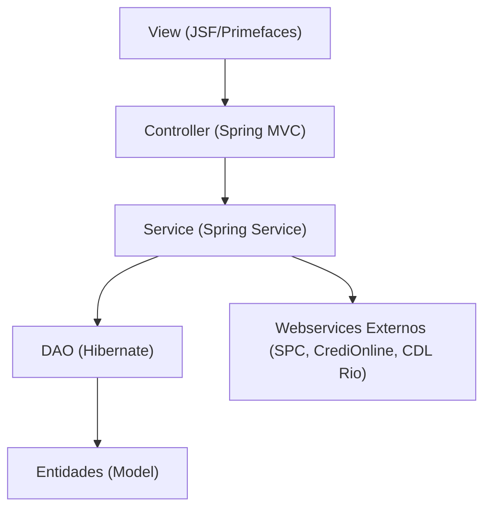
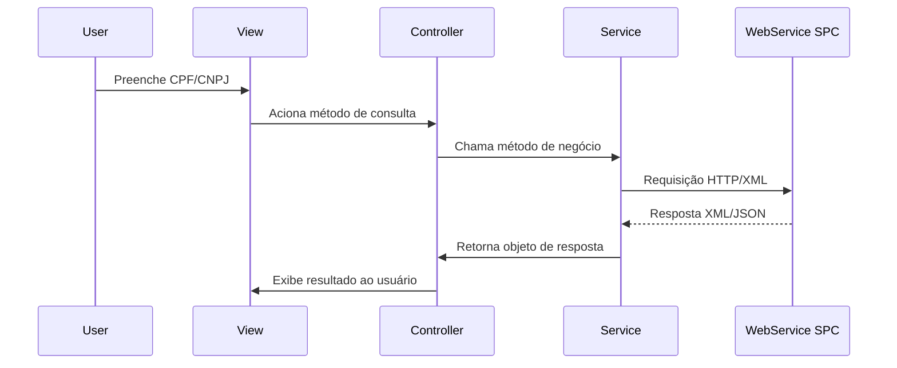

# 🚀 Orpecredit – Sistema de Consultas SPC

<p align="center">
  
</p>

---

## 📑 Sumário
- [Visão Geral do Sistema](#visão-geral-do-sistema)
- [Análise da Arquitetura](#análise-da-arquitetura)
- [Estrutura do Projeto Maven](#estrutura-do-projeto-maven)
- [Funcionalidades do SPC](#funcionalidades-do-spc)
- [Configurações e Integrações](#configurações-e-integrações)
- [APIs e Endpoints](#apis-e-endpoints)
- [Banco de Dados](#banco-de-dados)
- [Configuração e Deploy](#configuração-e-deploy)
- [Troubleshooting e Manutenção](#troubleshooting-e-manutenção)
- [Diagrama de Fluxo de Consulta](#diagrama-de-fluxo-de-consulta)
- [Contato](#contato)

---

## 🎯 Visão Geral do Sistema

> O **Orpecredit** é um sistema web Java 8/Maven, arquitetura MVC, para consultas ao Sistema de Proteção ao Crédito (SPC) e bureaus relacionados, apoiando decisões de crédito e gestão de risco.

### 🛠️ Principais Funcionalidades
- 🔍 Consultas de CPF/CNPJ em múltiplos produtos SPC
- 📝 Consulta de cheques, restritivos, quadros societários e comportamentais
- ❌ Negativação e baixa de registros
- 🌐 Integração com webservices externos (SPC, CrediOnline, CDL Rio)
- 🔐 Controle de acesso e autenticação
- 📊 Geração de relatórios e extratos

### 🏗️ Arquitetura Geral



> **Tecnologias:** Java 8, Maven, Spring, Hibernate, JSF 2.2, Primefaces, SQL Server, Logback/SLF4J

---

## 🧩 Análise da Arquitetura

### 🗂️ Model
- **Entidades:** `Usuario`, `Produto`, `ProdutoDefine`, `Extrato`
- **DTOs:** JAXB para XML dos webservices (`SPCAXML`)
- **Domínio SPC:** Classes em `br.com.orpecredit.wscdlrio.*`

### 🎨 View
- **Tecnologia:** JSF 2.2 + Primefaces
- **Templates:** `_template.xhtml`, `_templateLogin.xhtml`
- **Componentes:** Menus, formulários, exibição de resultados

### 🧑‍💻 Controller
- `ConsultaController`: Orquestra consultas SPC
- `LoginController`: Autenticação
- Outros: `NegativacaoController`, `UsuarioController`

### 🏷️ Padrões de Projeto
- MVC, DAO, Service Layer, Singleton/Session

---

## 📦 Estrutura do Projeto Maven

- **Empacotamento:** `WAR`
- **Dependências:** Spring, Hibernate, Primefaces, JSF, Logback, SQL Server JDBC, etc.
- **Diretórios:**
  - `src/main/java/` – Código Java
  - `src/main/resources/` – Configurações
  - `src/main/webapp/` – Views JSF, estáticos, WEB-INF
- **Configuração:** `config.properties`, alternância de endpoints

---

## 🏷️ Funcionalidades do SPC

- Consultas CPF: Pessoal Gold, Plus, CrediOnline, Cheque
- Consultas CNPJ: Empresarial Gold, Top, CrediOnline
- Negativação: Inclusão, baixa, listagem
- Extratos: Histórico de consultas

### 🔄 Fluxo de Consulta
1. Usuário seleciona tipo de consulta
2. Controller chama Service
3. Service monta requisição e chama webservice externo
4. Resposta processada e exibida

### 🌐 Integração com APIs Externas
- HTTP/XML/JSON via `HttpURLConnection`
- Classes: `ConexaoCdlRio`, `ConexaoCrediOnline`

### ✅ Validações
- CPF/CNPJ, permissões, erros de conexão e resposta

---

## ⚙️ Configurações e Integrações

- **Banco:** SQL Server, Apache DBCP, Hibernate
- **Segurança:** Spring Security, autenticação em sessão
- **Webservices:** URLs configuráveis, consumo HTTP
- **Logs:** Logback/SLF4J, saída padrão

---

## 📡 APIs e Endpoints

| Produto         | Endpoint (interno) | Parâmetros de Entrada         | Resposta         |
|-----------------|--------------------|------------------------------|------------------|
| Pessoal Gold    | `consultaCPF`        | cpf, estado                  | SPCAXML          |
| Empresarial Top | `consultaCNPJ`       | cnpj, estado                 | SPCAXML          |
| CrediOnline CPF | `crediOnlineCPF`     | cpf                          | String (JSON)    |
| Negativação     | `negativacaoIncluir` | Incluir (objeto)             | Incluir (objeto) |

> **Exemplo de Uso:**
```java
acerta = consultaService.acertaEssencial(cpf);
```

---

## 🗄️ Banco de Dados

- **Entidades:** `Usuario`, `Produto`, `ProdutoDefine`, `Extrato`
- **Tabelas:** `Cliente`, `Produto`, `ProdutoPlano`, `ClienteProdutoPlano`
- **Query Crítica:**
```sql
SELECT Cliente.idCliente, Cliente.NomeFantasia, Produto.idProduto, Cliente.Senha, 
       Produto.codigoProdutoFornecedor, Produto.fornecedor
  FROM Produto
 INNER JOIN ProdutoPlano ON Produto.idProduto = ProdutoPlano.idProduto
 INNER JOIN ClienteProdutoPlano ON ProdutoPlano.idProdutoPlano = ClienteProdutoPlano.idProdutoPlano
 INNER JOIN Cliente ON ClienteProdutoPlano.idCliente = Cliente.idCliente
 WHERE Cliente.CodigoCliente=:Cliente.CodigoCliente
   AND Cliente.Senha=:Cliente.Senha
```

---

## 🚀 Configuração e Deploy

- **Pré-requisitos:** Java 8, Maven 3.x, SQL Server, Tomcat/JBoss
- **Build:**
```bash
mvn clean package
```
- **Deploy:** Configurar `config.properties`, deploy do `.war` no servidor
- **Variáveis:** `jdbc.url`, `jdbc.username`, `jdbc.password`, URLs dos webservices

---

## 🛠️ Troubleshooting e Manutenção

- **Problemas comuns:** Erro de conexão, login inválido, respostas vazias
- **Logs:** Saída padrão, arquivo de logs
- **Manutenção:** Atualização de dependências, endpoints, scripts SQL

---

## 🗺️ Diagrama de Fluxo de Consulta



---

## 📬 Contato

Consulte a documentação interna da empresa para responsáveis técnicos e suporte. 