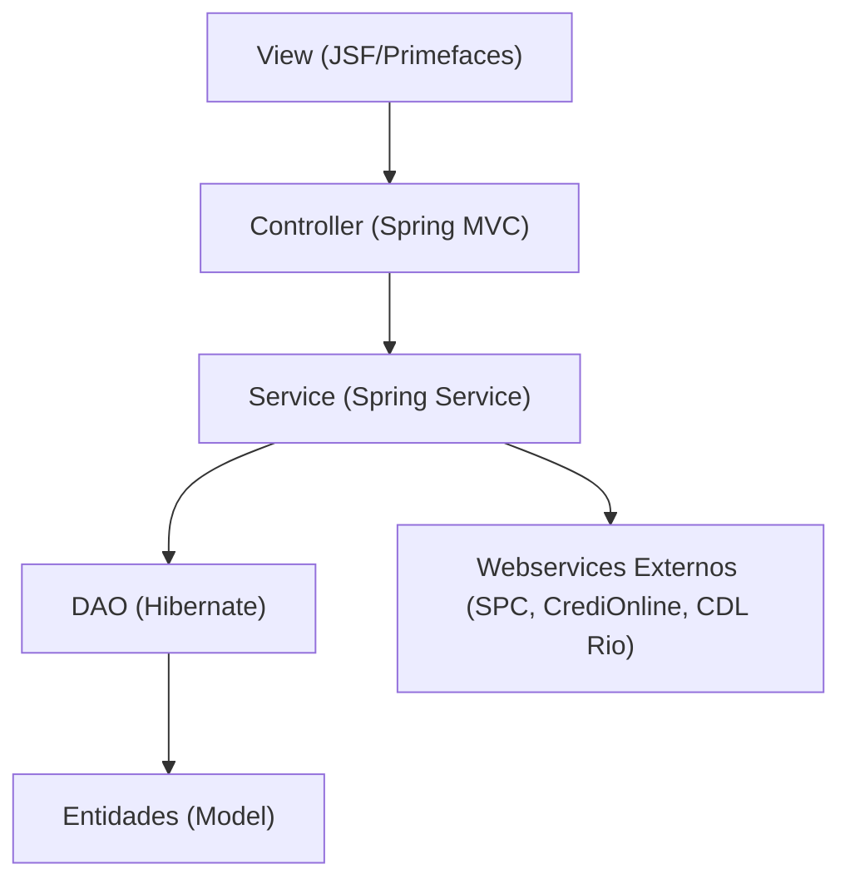
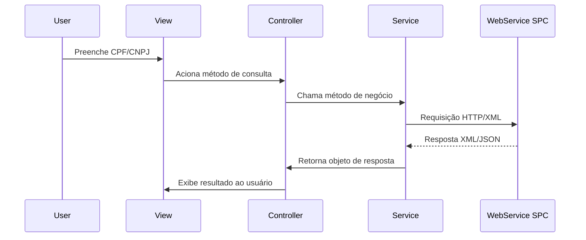

# 🚀 Orpecredit – Sistema de Consultas SPC


---

<p align="center">
  
</p>

---

## 📑 Sumário

- [Visão Geral](#-visao-geral)
- [Funcionalidades](#-funcionalidades)
- [Arquitetura](#-arquitetura)
- [Tecnologias](#-tecnologias)
- [Estrutura do Projeto](#-estrutura-do-projeto)
- [Configuração](#-configuracao)
- [Fluxo de Consulta SPC](#-fluxo-de-consulta-spc)
- [Endpoints Internos](#-endpoints-internos-exemplos)
- [Build & Deploy](#-build--deploy)
- [Troubleshooting](#-troubleshooting)
- [Manutenção](#-manutencao)
- [Contato](#-contato)

---

## 🎯 Visão Geral

O **Orpecredit** é um sistema web robusto para consultas ao Sistema de Proteção ao Crédito (SPC) e outros bureaus, apoiando decisões de crédito, análise de risco e negativação de clientes.

> **Stack:** Java 8 • Maven • Spring • Hibernate • JSF/Primefaces • SQL Server

---

## ✨ Funcionalidades

- 🔍 Consultas de CPF e CNPJ em múltiplos produtos SPC
- 🧾 Consulta de cheques, restritivos, quadros societários e comportamentais
- 🚫 Negativação e baixa de registros
- 🔗 Integração com webservices externos (SPC, CrediOnline, CDL Rio)
- 👤 Controle de acesso e autenticação de usuários
- 📊 Geração de relatórios e extratos de consultas

---

## 🏗️ Arquitetura



- **View:** JSF 2.2 + Primefaces
- **Controller:** Spring MVC
- **Service:** Lógica de negócio e integrações
- **DAO:** Hibernate
- **Webservices:** Integração HTTP/XML/JSON

---

## 🛠️ Tecnologias

| Categoria         | Tecnologias                                    |
|-------------------|------------------------------------------------|
| Backend           | Java 8, Spring 3.2, Hibernate 4                |
| Frontend          | JSF 2.2, Primefaces 5.3                        |
| Build/Deploy      | Maven, WAR, Tomcat/JBoss                       |
| Banco de Dados    | SQL Server, Apache DBCP                        |
| Integrações       | Webservices SOAP/REST (SPC, CrediOnline, CDL)  |
| Logging           | Logback, SLF4J                                 |

---

## 📁 Estrutura do Projeto

```
src/
  main/
    java/           # Código-fonte Java
    resources/      # Configurações e properties
    webapp/         # Views JSF, recursos estáticos, WEB-INF
```

---

## ⚙️ Configuracao

### Banco de Dados
- SQL Server
- Configuração: `src/main/resources/module/db-context.xml`
- Pool: Apache DBCP
- Propriedades: `config.properties` (`jdbc.url`, `jdbc.username`, `jdbc.password`)

### Segurança
- Spring Security
- Autenticação via `LoginController`

### Integrações Externas
- SPC, CDL Rio, CrediOnline
- URLs configuráveis em `config.properties`

### Logs
- Logback/SLF4J
- Configuração: `log4j.properties`

---

## 🔄 Fluxo de Consulta SPC



---

## 📡 Endpoints Internos (Exemplos)

| Produto         | Método Controller      | Parâmetros de Entrada | Resposta         |
|-----------------|-----------------------|----------------------|------------------|
| Pessoal Gold    | `consultaCPF`         | cpf, estado          | SPCAXML          |
| Empresarial Top | `consultaCNPJ`        | cnpj, estado         | SPCAXML          |
| CrediOnline CPF | `crediOnlineCPF`      | cpf                  | String (JSON)    |
| Negativação     | `negativacaoIncluir`  | Incluir (objeto)     | Incluir (objeto) |

---

## 🏗️ Build & Deploy

### Pré-requisitos
- Java 8
- Maven 3.x
- SQL Server
- Servidor de aplicação (Tomcat, JBoss, etc.)

### Build

```bash
mvn clean package
```

- Gera o arquivo `.war` para deploy

### Deploy
- Configure `config.properties` com dados de banco e endpoints
- Faça o deploy do `.war` no servidor de aplicação

---

## 🩺 Troubleshooting

- ❌ **Erro de conexão com webservice:** Verifique URLs e conectividade
- 🔑 **Login inválido:** Cheque credenciais e status do usuário
- 🕳️ **Respostas vazias:** Valide parâmetros e permissões do usuário
- 📝 **Logs:** Consulte saída padrão do servidor e arquivos em `log4j.properties`

---

## 🛡️ Manutencao

- Atualize dependências Maven periodicamente
- Ajuste endpoints em `config.properties` conforme necessário
- Mantenha scripts SQL para atualização de tabelas

---

## 📬 Contato

Consulte a documentação interna da empresa para responsáveis técnicos e suporte.

<p align="center">
  <sub>© Orpecredit – Sistema de Consultas SPC</sub>
</p> 